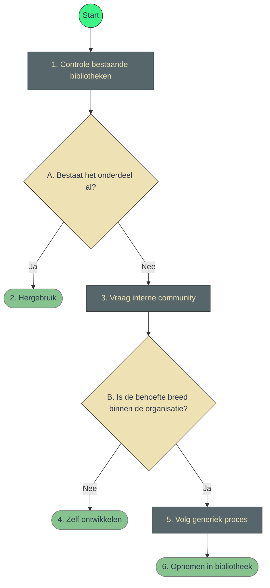

# Uitleg stappen

1. Controleren of het benodigde onderdeel al bestaat. Eerst in NLDS, dan in RHC, dan LUX.
2. Simpel: als het er al is, kan je het gebruiken. Met als enige voorbehoud dat er momenteel wat componenten in RHC zijn geïmplementeerd die niet aan de kwaliteitseisen voldoen - zie hiervoor de statustabel.
3. Opvragen in de community (ontwerpers én ontwikkelaars) of de behoefte breed is gedragen in de organisatie. Hierbij hoort ook een beoordeling van team LUX of het onderdeel wel in een Design System past.
4. Zo nee, kan het intern in het productteam worden ontwikkeld. Onderdelen kunnen altijd worden heroverwogen als ze toch een breed nut blijken te hebben.
5. Zo ja, kan het onderdeel op de gezamenlijke backlog op github worden gezet. Vanaf daar begint het werk van POs en dev teams, prioritering, planning, ontwikkeling, testen en opleveren.

## Wat is er nog meer nodig?

1. Checklist of componenten kunnen worden overwogen
   - herbruikbaarheid: onderdeel is in meerdere projecten in de organisatie nodig
   - toepassing: onderdeel kan generiek gebouwd worden en aan toegankelijkheidseisen voldoen
   - doel: één of meerdere user stories moeten worden vastgelegd om te bewijzen dat de behoefte bestaat
2. Checklist of de implementatie van een component aan generieke eisen voldoet
   - toegankelijkheid
   - documentatie
   - naamgeving
3. Lijst van alle reguliere en ad-hoc vergaderingen
4. Duidelijk stellen welk niveau dit is: Logius
