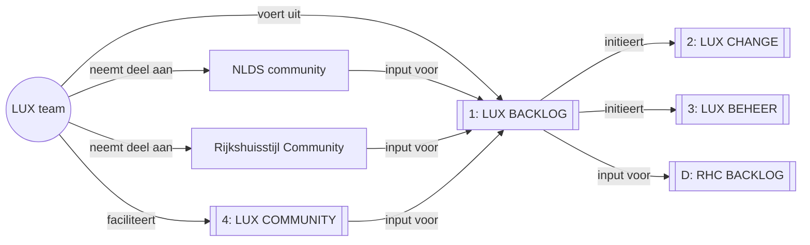
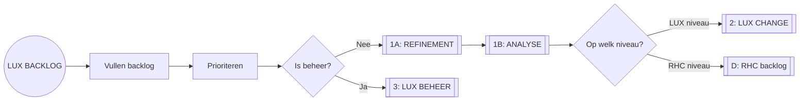
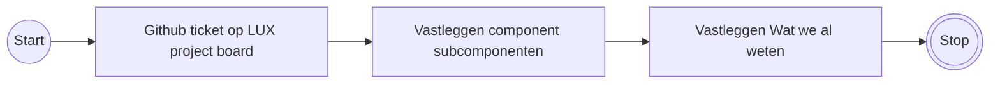
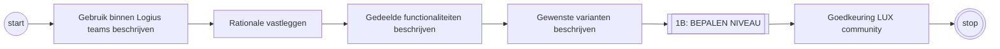
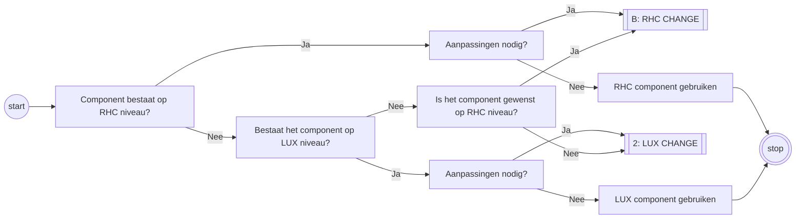
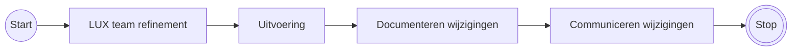
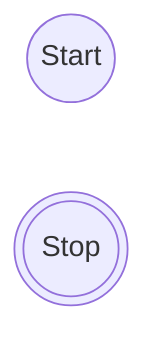
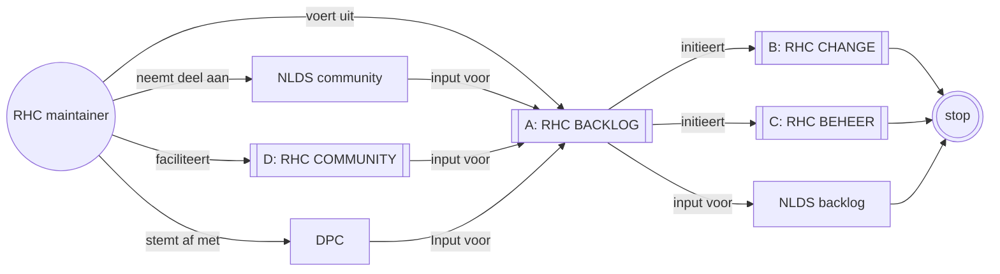

# LUX Processen

- Doel 1: Inzicht bieden in de processen en werkzaamheden binnen team LUX.
- Doel 2: LUX gebruikers in staat stellen om te begrijpen hoe ze met LUX kunnen samenwerken

## Overzicht LUX

- _Het LUX team draagt zorg voor correcte deelname aan NLDS en RHC communities_
- _Via de LUX community is er kennisdeling, feedbackmoment en samenwerking door en met de LUX gebruikers_
- _Planbaar werk wordt via de backlog opgevoerd, gepriotiseerd, refined en opgepakt_

---

### 1: LUX Backlog

- _PO team LUX is eigenaar van dit proces en de backlog_
- _Het gehele proces wordt samen met meewerkende gebruikers doorlopen_
- _Soms is er werk alleen voor het LUX team. Dit werkt wordt eventueel op een aparte backlog volgens hetzelfde proces behandeld_

---

#### 1A: REFINEMENT

- _Voorbeeld component opbouw: Page Header -> Navigatie -> Button_
- _Desnoods worden deze stappen meermaals doorlopen totdat het component voldoende refined is._
- _Wat we al weten is o.a.: lopende github discussies op NL, RHC of LUX niveau, bekend onderzoek, best practices_

---

#### 1B: ANALYSE

- Wensen en onderzoeksuitslagen als comment onder Github ticket plaatsen
- Discussie voeren op Slack in RHC channel, verwijzing naar NLDS github discussie - toevoegen hoe component per team/afdeling binnen Logius er uit ziet (designs aflopen om de varianten in kaart te brengen. Liefst alle plekken waar het component staat. Maar praktisch alleen binnen het component waar het nu om gaat (bv button in header, of alle buttons)).
- RHC stijldiscussie bekijken/aanvullen
- RHC discussie: Beargumenteren welke bron we gekozen hebben (utrecht of nlds etc)
- Teams verdiepen zich in het component, hoe het in hun designs/applicaties gebruikt wordt, wensen, problemen, toepassingen, github discussies nalezen, onderzoek doen

---

#### 1C: BEPALEN NIVEAU

Het doel van team LUX is op RHC of op LUX niveau componenten aan te dragen en te beheren.
Checks:

- Component is beschikbaar binnen RHC>LUX?
- Nee: is component binnen NLDS beschikbaar? (HoF>Candidate>Community)
- Ja: Beschikbare component voldoet aan wensen?
- wensen bestaand component op backlog opvoeren waar het component leeft
- Nieuw component opvoeren RHC backlog
- Als dit component niet gewenst is, dan op lager niveau oplossen RHC>LUX>team

DD[Kijken of component al ergens beschikbaar is?]
DDD[Beschikbare component heeft aanpassing nodig?]
DDD[]

- PO LUX is initiator en eigenaar van de LUX backlog, maar vult en prioriteert deze samen met de PO's van gebruikerteams
- PO's maken afspraken over de werkvorm tussen de verschillende teams
- In prio, refine en uitvoering wordt samen- en meegewerkt met en door gebruikerteams

---

### 2: LUX CHANGE

- Changes documenteren
- Wijzigingen communiceren (trigger LUX COMMUNITY)

---

### 3: LUX BEHEER

- Updates aan RHC bieb, tokens en componenten doorvoeren in LUX bieb, tokens en componenten
- Changes documenteren
- Wijzigingen communiceren (trigger LUX COMMUNITY)

### 4: LUX community

Zichtbaarheid, feedback loop en duidelijke communicatie naar gebruikers van LUX

- Delen updates LUX
- Kennissessies
- Workshops & hackathons

## Overview RHC

### A: RHC BACKLOG

- ???

### B: RHC CHANGE

- Nieuwe en aanpassingen aan componenten doorvoeren binnen RHC bieb, tokens en repo
- Documenteren changes
- Wijzigingen communiceren (trigger: RHC community)

### C: RHC BEHEER

- Updates vanuit NLDS verwerken in RHC bieb, RHC tokens en RHC repo
- Documenteren changes
- Wijzigingen communiceren (trigger: RHC community)

### D: RHC COMMUNITY

- Communiceren over wijzigingen
