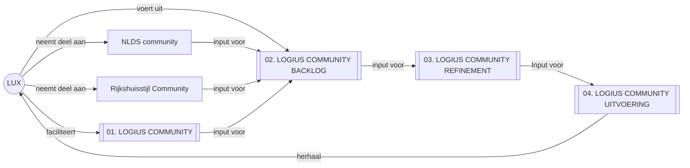
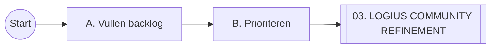
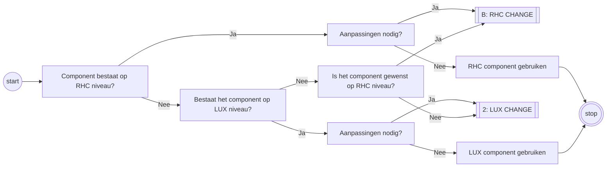
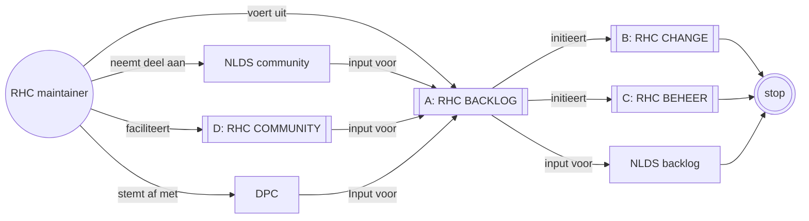

# LUX Processen

- Doel 1: Inzicht bieden in de processen en werkzaamheden binnen team LUX.
- Doel 2: LUX gebruikers in staat stellen om te begrijpen hoe ze met LUX kunnen samenwerken

## 00. Overzicht LUX

- Het LUX team faciliteert deelname in de NL Design System communities en overziet correcte toepassing van de NL Design System architectuur binnen Logius
- Logius teams doen mee via de Logius Community
- Teams kunnen zelf beslissen of ze actief willen meewerken. Dit wordt via de Product Owners afgestemd
- Backlog, refinement en uitvoering worden gezamenlijk opgepakt en uitgevoerd

## 01. LOGIUS COMMUNITY

Proces voor het samenwerken van de Logius community. In de community wordt kennis en informatie gedeeld over LUX en NL Design System. LUX faciliteert verschillende mogelijkheden voor Logius teams om samen te werken met LUX. Deze samenwerking zie je in alle vervolgprocessen terug komen.

TODO: Beantwoorden: Is dit een proces of zijn dit alleen de contactmomenten die als input dienen voor de backlog?

## 02. LOGIUS COMMUNITY BACKLOG

Dit proces is er voor bedoeld om wensen en prioriteiten in kaart te brengen en alle informatie te verzamelen en structureren die nodig is om een component te kunnen ontwikkelen.

### A. Vullen backlog

- Product owner LUX stelt samen met product owners Logius teams de backlog op het Logius Community Github bord
- Soms is er werk dat alleen voor het LUX team is. Dit handelt het LUX team zelfstandig af, eventueel op een aparte backlog
- Backlog item bevat: Duidelijke titel, beschrijving van de wens, wie de wens heeft

### B. Prioriteren

- Product owner LUX zal samen met Product owners Logius teams de backlog prioriteren
- Prioriteit wordt gegeven op basis van de behoefte van de Logius teams

## 03. LOGUS COMMUNITY REFINEMENT

Het doel van de refinement is om als Logius organisatie eens te worden over de componenten die we nodig hebben in een design system, welke functionaliteiten en varianten ze nodig hebben.

- Component wordt in Logius Community Refinement behandeld (wie bereid voor?)
- Beschikbare informatie, zoals Github discussies worden toegevoegd (welke informatie?)
- Teams leveren voorbeelden aan hoe zij het component nu/willen gebruiken
- De varianten en anatomie van het component wordt vastgelegd bij het backlog item
- Eventuele ontwerpkeuzes worden al vastgelegd (waar?)
- Openstaande vragen worden genoteerd bij het backlog item
- Community bepaald samen met LUX welke vragen tenminste beantwoord moeten zijn voor het component opgepakt kan worden. Zo nodig wordt refinement enkele keren herhaald

Controles:

- Is het component door meerdere teams gewenst / er is geen bezwaar tegen het gerefinede component?
- Er is voldaan aan de DoR?

## 04. LOGIUS COMMUNITY UITVOERING

In dit proces worden backlog items uitgevoerd aan de hand van de gerefinede backlog items. Dit houd in: onderzoek, design, bouw, testen en gebruiken van nieuwe maar ook bestaande componenten.

- 1 ontwerp maken in Figma die alle functionaliteiten en varianten bevat, in de stijl die Logius nodig heeft. Rijkshuisstijl wordt zoveel mogelijk aangehouden (dit pakt 1 iemand meestal op?)
- Ontwerp met Logius community afstemmen
- RHC/NLDS/LUX component onderzoek: wat is er al dat bruikbaar is
- Geschikte componenten selecteren, ontbrekende functionaliteiten/varianten noteren
- Eventuele discussies in NLDS/RHC communities starten (welke, en waanneer en waarom?)
- Met Logius community afstemmen welke bron gebruikt wordt, of dat een eigen component gemaakt wordt
- Tokens instellen
- Component bouwen/aanpassen/laten aanpassen
- Updates aan Figma bieb, tokens, repo en/of NPM packages documenteren en delen met Logius community
- Check?: moeten we RHC en/of NLDS community component stappen doorlopen?
- Na dit proces?: Logius community het nieuwe component laten gebruiken

### 03.1 BEPALEN NIVEAU

TODO: splitsen in zoeken naar geschikte bron en uitvoering.

Het doel van team LUX is op RHC of op LUX niveau componenten aan te dragen en te beheren.
Checks:

- Component is beschikbaar binnen RHC>LUX?
- Nee: is component binnen NLDS beschikbaar? (HoF>Candidate>Community)
- Ja: Beschikbare component voldoet aan wensen?
- wensen bestaand component op backlog opvoeren waar het component leeft
- Nieuw component opvoeren RHC backlog
- Als dit component niet gewenst is, dan op lager niveau oplossen RHC>LUX>team

DD[Kijken of component al ergens beschikbaar is?]
DDD[Beschikbare component heeft aanpassing nodig?]
DDD[]

- PO LUX is initiator en eigenaar van de LUX backlog, maar vult en prioriteert deze samen met de PO's van gebruikerteams
- PO's maken afspraken over de werkvorm tussen de verschillende teams
- In prio, refine en uitvoering wordt samen- en meegewerkt met en door gebruikerteams
- Changes documenteren
- Wijzigingen communiceren (trigger LUX COMMUNITY)

## Overview RHC

